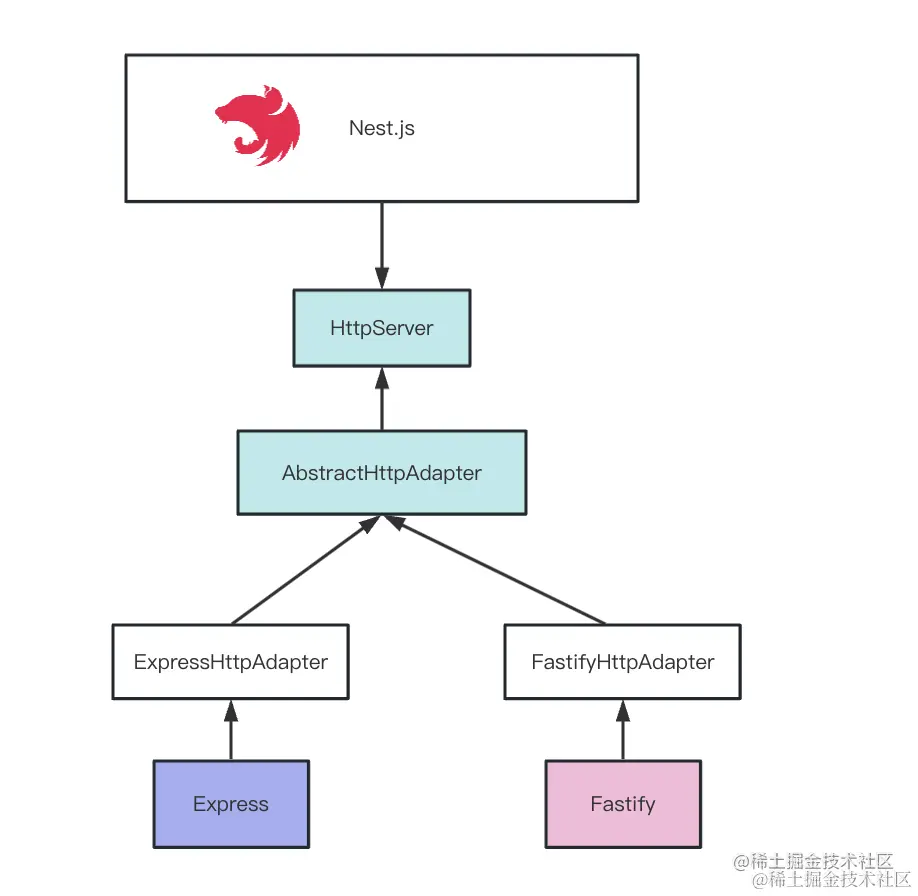
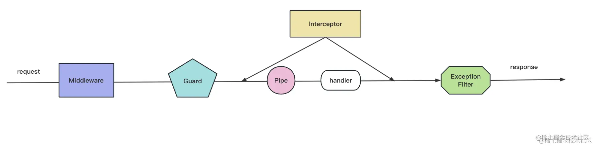

# {{ $frontmatter.title }}

{{ $frontmatter.description }}

- 著名 nest 开源项目：[apiTabel](https://github.com/apitable/apitable)
- nestjs 架构 -- 适配器设计模式

  

# nest 的使用

- 新建项目

```sh
# 第一种：
npx @nestjs/cli new [projectName]
# 第二种
pnpm i -g @nestjs/cli
nest new [projectName]
npm update -g @nestjs/cli
# 帮助
nest -h
```

- nest new 快速创建项目
- nest generate resource modlule 快速生成 modlule 模块的 crud 代码
- nest build 使用 tsc 或者 webpack 构建代码
- nest start 启动开发服务，支持 watch 和调试
- nest info 打印 node、npm、nest 包的依赖版本

# 5 种 http 数据传输方式

```sh
# 1、 路径参数111
http://power17.xyz/1111
# 2、query（get）
http://power17.xyz?name=power&age=20
# 3、 form 表单提交数据
application/x-www-form-urlencoded
post
http://power17.xyz
body：name=power&age=20
# 4、form-data：content type 为 multipart/form-data（适合传输文件）

# 5、json
form-urlencoded 需要对内容做 url encode，而 form data 则需要加很长的 boundary，两种方式都有一些缺点。 json没有
Nest 解析 form data 使用 FilesInterceptor 的拦截器，用 @UseInterceptors 装饰器启用，然后通过 @UploadedFiles 来取。非文件的内容，同样是通过 @Body 来取


```

- Nest 解析 form data 使用 FilesInterceptor 的拦截器，用 @UseInterceptors 装饰器启用，然后通过 @UploadedFiles 来取。非文件的内容，同样是通过 @Body 来取。

```js
// npm i -D @types/multer

import { AnyFilesInterceptor } from '@nestjs/platform-express';
import { CreatePersonDto } from './dto/create-person.dto';

@Controller('api/person')
export class PersonController {
  @Post('file')
  @UseInterceptors(
    AnyFilesInterceptor({
      dest: 'uploads/',
    })
  )
  body2(@Body() createPersonDto: CreatePersonDto, @UploadedFiles() files: Array<Express.Multer.File>) {
    console.log(files);
    return `received: ${JSON.stringify(createPersonDto)}`;
  }
}
```

## IOC：Inverse of Controll,DI:Dependency Injection

## AOP （Aspect Oriented Programming



## 调试

```sh
#  chrome://inspect/  9229
node --inspect-brk index.js
```

## nest 装饰器

- @Module： 声明 Nest 模块
- @Controller：声明模块里的 controller
- @Injectable：声明模块里可以注入的 provider
- @Inject：通过 token 手动指定注入的 provider，token 可以是 class 或者 string
- @Optional：声明注入的 provider 是可选的，可以为空
- @Global：声明全局模块
- @Catch：声明 exception filter 处理的 exception 类型
- @UseFilters：路由级别使用 exception filter
- @UsePipes：路由级别使用 pipe
- @UseInterceptors：路由级别使用 interceptor
- @SetMetadata：在 class 或者 handler 上添加 metadata
- @Get、@Post、@Put、@Delete、@Patch、@Options、@Head：声明 get、post、put、 -delete、patch、options、head 的请求方式
- @Param：取出 url 中的参数，比如 /aaa/:id 中的 id
- @Query: 取出 query 部分的参数，比如 /aaa?name=xx 中的 name
- @Body：取出请求 body，通过 dto class 来接收
- @Headers：取出某个或全部请求头
- @Session：取出 session 对象，需要启用 express-session 中间件
- @HostParm： 取出 host 里的参数
- @Req、@Request：注入 request 对象
- @Res、@Response：注入 response 对象，一旦注入了这个 Nest 就不会把返回值作为响应了，除 - 非指定 passthrough 为 true
- @Next：注入调用下一个 handler 的 next 方法
- @HttpCode： 修改响应的状态码
- @Header：修改响应头
- @Redirect：指定重定向的 url
- @Render：指定渲染用的模版引擎
