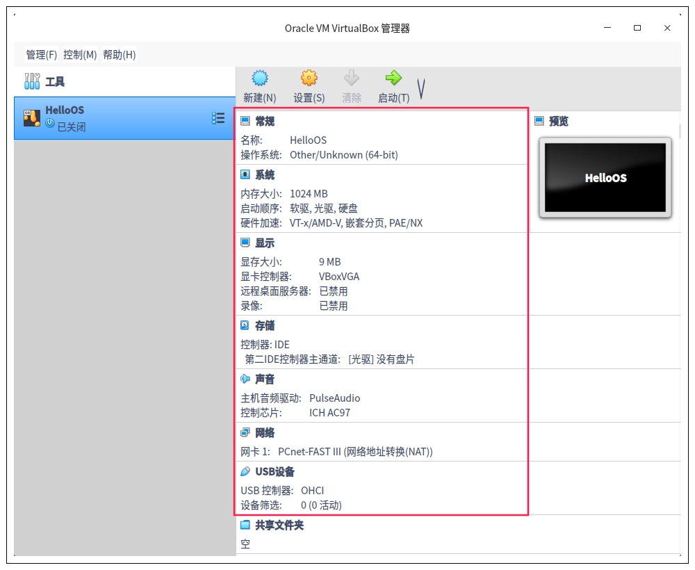
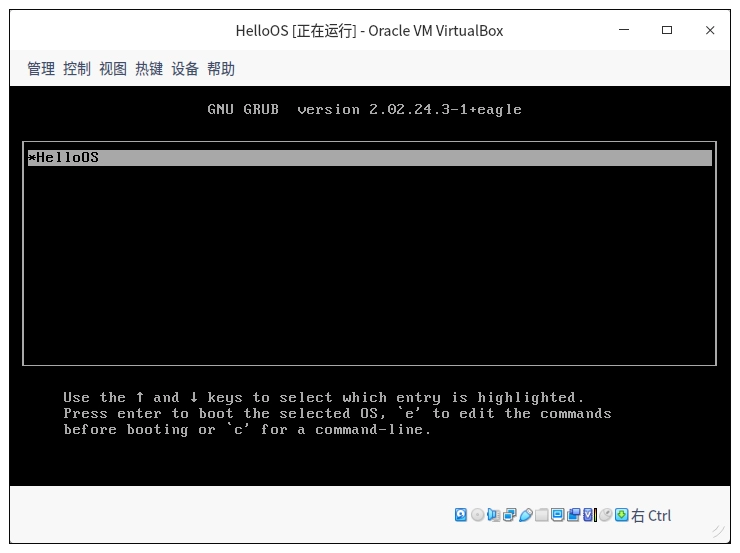
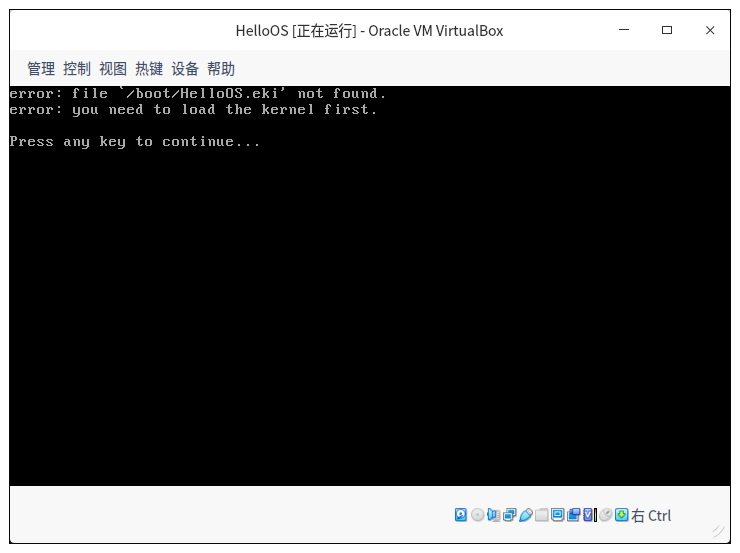

# {{$frontmatter.title}}

- {{$frontmatter.description}}

- [参考链接](https://blog.csdn.net/weixin_70137390/article/details/124724957)
- [操作系统 45 将](https://time.geekbang.org/column/article/379291)

## 一、linux 系统的安装

### 1、下载系统镜像文件

- [Ubuntu 22.04.4 LTS](https://ubuntu.com/download/desktop)
- [烧录工具：rufus](https://rufus.ie/zh/)

### 2、安装 ubuntu

- 重启电脑 按 del 进入 bios，u 盘启动

## 二、建立虚拟电脑

### 1、安装 virtualBox

```sh
sudo apt-get install virtualbox
```



### 2.1、生产虚拟磁盘磁盘

```sh
dd bs=512 if=/dev/zero of=hd.img count=204800

;bs:表示块大小，这里是512字节
;if：表示输入文件，/dev/zero就是Linux下专门返回0数据的设备文件，读取它就返回0
;of：表示输出文件，即我们的硬盘文件。
;count：表示输出多少块
```

### 2.2 虚拟硬盘文件变成 Linux 下的回环设备

```sh
sudo losetup /dev/loop12 hd.img
```

tip：输完 sudo losetup /dev/loop0 hd.img 以后系统提示我说：使用设备失败。用 sudo losetup -l 来查看没有的设备替换上面命令的 12，在重试

### 2.3 将刚刚的回环设备（磁盘）建立 EXT4 文件系统

```sh
sudo mkfs.ext4 -q /dev/loop0
```

### 2.4 挂载

```sh
sudo mount -o loop ./hd.img ./hdisk/ ;挂载硬盘文件
sudo mkdir ./hdisk/boot/ ;建立boot目录
```

### 3、安装 GRUB

```sh

#安装GRUB，如果不成功，请添加--target i386-pc
sudo grub-install --boot-directory=./hdisk/boot/ --force --allow-floppy /dev/loop0
；--boot-directory 指向先前我们在虚拟硬盘中建立的boot目录。
；--force --allow-floppy ：指向我们的虚拟硬盘设备文件/dev/loop0
```

现在 /hdisk/boot/ 目录下多了一个 grub 目录，表示我们的 GRUB 安装成功
建立 grub.cfg 配置文件，GRUB 正是通过这个文件内容，查找到我们的操作系统映像文件的。

```sh
menuentry 'HelloOS' {
insmod part_msdos
insmod ext2
set root='hd0' #我们的硬盘只有一个分区所以是'hd0'
multiboot2 /boot/HelloOS.eki #加载boot目录下的HelloOS.eki文件
boot #引导启动
}
set timeout_style=menu
if [ "${timeout}" = 0 ]; then
  set timeout=10 #等待10秒钟自动启动
fi
```

### 4、转为 virtualbox 的可识别 vdi 格式

```sh
VBoxManage convertfromraw ./hd.img --format VDI ./hd.vdi
;convertfromraw 指向原始格式文件
；--format VDI  表示转换成虚拟需要的VDI格式
```

### 5、启动虚拟机

```sh
VBoxManage startvm HelloOS  #启动虚拟机
```

### 6、出现 GRUB 引导菜单


错误显示，GRUB 没有找到 HelloOS.eki 文件，这是因为我们从来没有向虚拟硬盘中放入 HelloOS.eki 文件，所以才会失败

