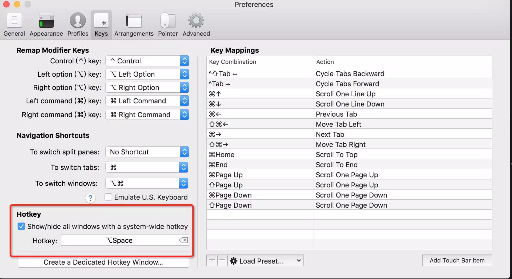

# {{$frontmatter.title}}

- {{$frontmatter.description}}

## Mac 系统下 配置了 SSH keys，每次操作都提示 "Enter passphrase for key" 输入密码

```
# ssh-add 命令是把专用密钥添加到ssh-agent的高速缓存
ssh-add ~/.ssh/id_rsa
```

## 安装 iterm2

唤醒热键
给终端加一个快速唤醒/隐藏的快捷键是必须要做的，否则用鼠标找到终端的快捷方式再打开这种做法不仅慢而且逼格低，设置方式 iterm2 -> Preferences -> Keys -> Hotkey


### 个人喜好这里建议给 iterm2 配置一个透明度，看起来体验感舒适很多 iterm2 -> Preferences -> Profiles -> Window -> Transparency

### 快捷键使用

- ctrl + a/e 快速切换到当前正在输入的文本的头部／尾部
- ctrl + u 清空当前输入
- cmd + T 打开一个新的 iterm2 Tab
- cmd + 方向键 左右切换 Tab
- cmd + D 分屏
- cmd + K 清屏
- cmd + N 打开一个新的 iterm2 窗口

## 安装 zsh

```sh
sh -c "$(curl -fsSL https://raw.github.com/ohmyzsh/ohmyzsh/master/tools/install.sh)"

# 更换主题
$ vim ~/.zshrc # 打开zsh配置文件
10 ZSH_THEME = "ys" # 在第10行设置当前主题为ys
$ source ~/.zshrc # 重新执行一遍zsh配置文件
```

# 安装插件

```sh
# 增加插件
vim ~/.zshrc
plugins = (
 git
 autojump
 zsh-autosuggestions
 zsh-syntax-highlighting
 last-working-dir
)
$ source ~/.zshrc
# 自动补全提示
git clone https://github.com/zsh-users/zsh-autosuggestions ~/.oh-my-zsh/custom/plugins/zsh-autosuggestions
# 高亮git clone https://github.com/zsh-users/zsh-syntax-highlighting.git ~/.oh-my-zsh/custom/plugins/zsh-syntax-highlighting

source ~/.zshrc
```

## npm link

```sh
cd vue // 进入本地clone下来的vue文件夹
npm link // 如果没有全局安装过vue 此时会创建全局node_modules下的一个软链接vue指向本地clone的vue入口文件
npm link vue // 在需要用调试vue模块的应用执行该命令会将当前应用的node_modules/vue指向全局node_modules/vue软链接
```

## vim 快捷键

- :wq 退出 vim。stackoverflow 每日搜索次数第一问题，如何退出 vim:)
- i 进入插入模式
- q 进入可视模式，可以用光标来选择文本
- jk 上下移动
- hl 左右移动
- ctrl + b/f 上下翻页
- 0/$ 光标快速移动到行首／行尾
- / 搜索
- n/N 跳转到下一个／上一个 搜索词
- :s/old/new/g 单行替换
- :%s/old/new/g 全局替换

## 安装插件 janus

- 显示行号
- 文本高亮, 搜索高亮
- 句尾显示.号
- 轻松切换多种显示方式，水平显示 or 垂直显示

参考 [打造舒适高效的前端开发环境](http://fe.ssr-fc.com/)
